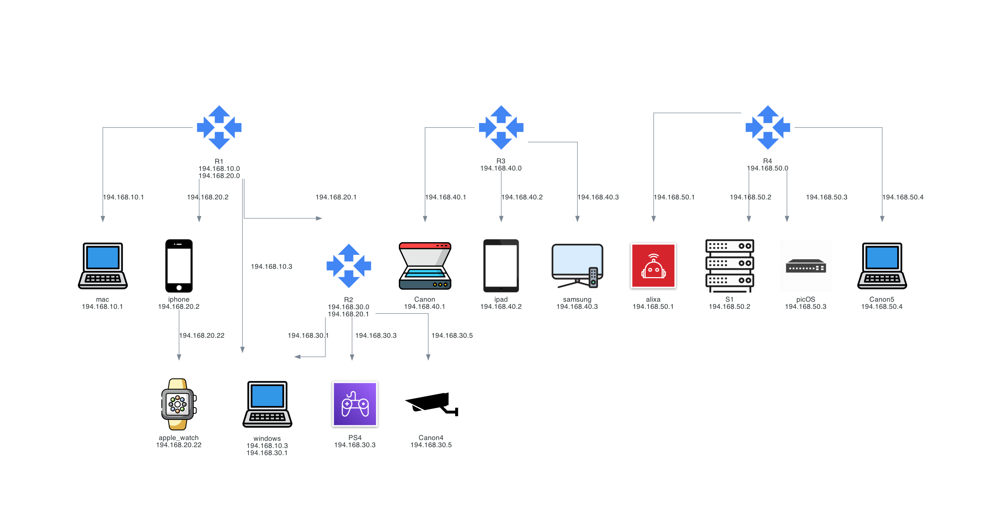

# Générateur de schémas réseau en Python

Application graphique réalisée en Licence Informatique pour transformer deux fichiers CSV décrivant les équipements et leurs connexions en un schéma réseau.

## Aperçu


## Fonctionnalités
- Sélection des fichiers CSV depuis une interface Tkinter.
- Affichage des équipements avec leur nom, leurs adresses IP et une icône.
- Création des liens à partir des adresses IP du fichier de connexions.
- Export PNG et affichage du résultat dans une fenêtre.
- Ouverture des CSV dans une application externe pour les modifier.

## Technologies
Python, Tkinter, Pandas, Diagrams, Pillow et Graphviz.

## Installation et lancement
Utilisez une installation Python disposant de Tkinter et installez Graphviz sur votre système. La commande `dot` doit être accessible dans le PATH.

```bash
git clone https://github.com/abir-benelhadj/ProjetPythonL3.git
cd ProjetPythonL3
python -m venv .venv
```

Activez l’environnement avec `source .venv/bin/activate` sous macOS/Linux, ou `.venv\Scripts\activate` dans l’invite de commandes Windows, puis :

```bash
python -m pip install pandas diagrams Pillow
cd python
python code.py
```

Lancez le programme depuis le dossier `python` : les chemins des icônes sont relatifs à ce dossier.

## Format des données
Les CSV utilisent un point-virgule comme séparateur.

| Fichier | Colonnes |
| --- | --- |
| `appareil.csv` | `type`, `nom`, puis `ip1`, `ip2`, etc. |
| `connection.csv` | `nom`, puis `c1`, `c2`, etc. contenant les IP cibles |

Sélectionnez les deux exemples fournis, puis cliquez sur « Générer le Schéma ». Le fichier `Schema_configuration_reseau.png` est écrit dans le dossier de lancement. Une adresse cible doit correspondre à une IP du fichier des appareils pour créer un lien. Ces données servent à illustrer une topologie ; l’application ne valide pas une configuration réseau réelle.

## Documents
- [Premier rendu](Rendu%201.pdf)
- [Deuxième rendu](Rendu%202.pdf)
- [Rapport](https://github.com/user-attachments/files/18051953/Rapport.pdf)

## Travail en binôme
Groupe HA : Abir BEN EL HADJ et Husna ALLAOUI.

Recherche des bibliothèques, génération du diagramme et conception de l’interface réalisées ensemble. Abir a pris en charge la sélection des icônes, la liaison des CSV avec Tkinter et les paramètres de fenêtre. Husna a travaillé sur la fenêtre principale et l’affichage de l’image.

## Limite connue
La fonction d’ouverture externe utilise actuellement `open` pour tous les systèmes POSIX : cette fonction nécessite une adaptation sur Linux pour utiliser `xdg-open`. La génération du schéma est indépendante de cette fonction.
